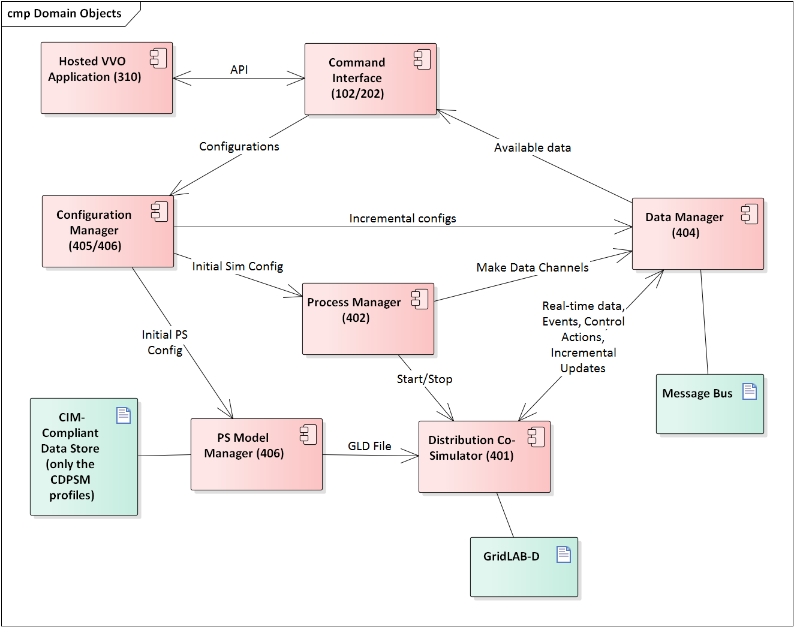

.. _rc1-diagrams-label:

UML for Release Cycle 4
^^^^^^^^^^^^^^^^^^^^^^^

Our objective is to demonstrate useful functionality, which is
standards-compliant, by the end of March 2017. A simple heuristic VVO
application will be running in GridAPPS-D. In terms of the Functional
Requirements, we will be implementing:

-  102/202 Command Interface

-  301 Real-time Simulation Data

-  310 Hosted Application, but short-cutting the registration process

-  401 Distribution Co-Simulator (partial)

-  402 Process Manager (partial)

-  404 Data Manager (partial)

-  405 Simulation Manager (partial)

-  406 Power System Model Manager (partial)

-  413 Platform Manager (encapsulating 401 and 403-406)

This represents five out of twelve Internal Functions from the
Functional Requirements, in partial form. The deadline leaves four
months for detailed design and implementation, plus two months for
documentation and testing. Therefore, we have chosen a minimal set of
functions that can show end-to-end use of GridAPPS-D at the first
milestone.

In developing the work breakdown structure (WBS), we noted that
real-time simulation data is published with no time lags or errors in
Release 1. However, data flow in a real DMS is affected by sensor and
communication system performance, and also by the action of other
subsystems. In Release 2, this might be addressed through some
combination of:

-  Communication and sensor models in the Distribution Co-Simulator

-  Adding MDM and SCADA service attributes to the 407 Service Manager

-  Filters on 301 Real-time Simulation Data

These decisions, and many others affecting Release 2 and Release 3, can
be deferred until we gain experience developing Release 1.

Figure 1 shows the software components planned for Release 1. Most of
these correspond to internal functions from the Functional Requirements,
with some relatively minor re-factoring. The Power System Model Manager
functionality has been split. The data store management and the creation
of a complete GridLAB-D model appear at the bottom. Once the simulator
is running, incremental changes are posted to the messaging bus.

Most of the “pink” components in Figure 1 are assigned to one task,
except:

-  The 310 VVO is a sub-task of the Command Interface, due to the close
   coupling of those efforts. The team on this task needs both power
   system and software skills.

-  A separate task has been added for some project-level items.

|rc1_tasks_image0|

Figure 1: Component Diagram for GridAPPS-D Release 1

Initial Work Breakdown for Release Cycle 1
^^^^^^^^^^^^^^^^^^^^^^^^^^^^^^^^^^^^^^^^^^

The Release 1 work breaks down into seven tasks, listed below. Three
**critical items must be completed first**; these are highlighted in
red. There are other inter-task dependencies that have not yet been
called out. We plan to sequence the work over eight two-week “sprints”
within the four months allocated for detailed design and development,
using an agile process (Kanban).

1) Project-level Elements

   a. **Identify a power system model (note: IEEE-13 is already in
      CIM/CDPSM)**

   b. Design data store schema

   c. Manually ingest power system models

2) Command Interface

   a. Design APIs

      i.  For all configurations in Task 4

      ii. For power system control actions (e.g. open/close switch)

   b. **Select one language binding** (e.g. Python, Java, C++, MATLAB)
      and implement

   c. Develop a heuristic volt-var application (VVO) in the bound
      language

   d. Integrate VVO into GridAPPS-D

3) Messaging and Data Manager

   a. **Select a messaging framework (eg. ZeroMQ)**

   b. Create communication APIs

   c. Receives real-time data from simulator

   d. Receives power system control actions

   e. Handle communication between GridAPPS-D managers

   f. Log messages to file

4) Configuration Manager (both Power System Config & Simulation Config)

   a. Receive configurations from command interface over message bus

   b. Translate configurations to native GridLAB-D

   c. Translate and publish incremental update messages

   d. Send configurations to Process Manager for simulation start

5) Process Manager

   a. Receives configurations from the Configuration Manager

   b. Send configuration to the Distribution Co-Simulator

   c. Start Co-Simulation Process

   d. Create simulation data channels and inform application

   e. Stop simulation process

6) Distribution Co-Simulator (wraps GridLAB-D)

   a. Accepts configurations from Process Manager

   b. Start simulation

   c. Produce and publish data in real time

   d. Accept changes in real time (e.g. capacitor switching) via message
      bus

7) Power System Model Manager

   a. Access the power system model in data store

   b. Create native GridLAB-D file for initial loading into the
      simulator

