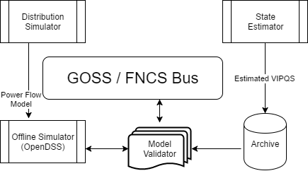

Model Validator
===============

Objectives
----------

The model validator will detect and attempt to correct unreasonable
component interconnections and network parameters.

Use Cases
~~~~~~~~~

-  Valid transformer size and orientation (Utility): orientation is not
   captured explicitly in their GIS system.

-  Discover secondary line impedance parameters (Utility) conductor type
   and line length are currently based on generic assumptions.

-  Sanity check or estimate transformer size and impedance.

-  Verify that the nominal voltage of nodes matches the base voltage of
   the segment: generally the winding voltage of the upstream
   transformer or swing bus voltage.

-  Sanity check conductor sizes and line current ratings.

-  Validate and fill in regulator and capacitor control settings.

-  Check phase continuity (GridLAB-D may not model phase
   discontinuities)

Design
------

The model validation application will be implemented in Python.

|image1|

Inputs:
~~~~~~~

The model validator will have access to the CIM database and archived
data from the state estimator.

Outputs:
~~~~~~~~

The model validator will one or both of the following outputs:

-  Model status: log file or GUI pipe for identified issues.

-  Model correction: CIM updates to correct identified issues.

Testing and Validation
----------------------

Evaluation metrics
~~~~~~~~~~~~~~~~~~

-  Ability to detect known issues.

Scenarios
~~~~~~~~~

-  Utility merger: models with different format may be interpreted
   differently, creating issues a CIM model.

-  Data entry issue: model update does not match upgrade performed in
   the field

Operating/Running
-----------------

The model validator script will execute once when called by the
platform.

At initialization, a configuration file will be read for:

-  Mode (status, quiet, verbose; see outputs section)

-  Selectable validation items (use cases)

