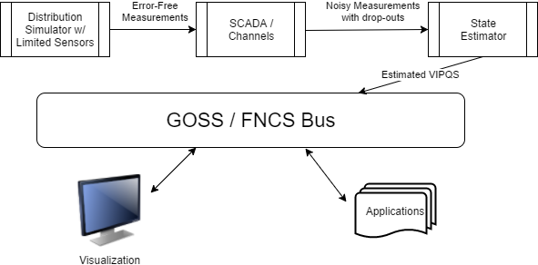
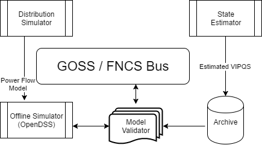

.. _pnnl_apps_rc2:

.. toctree::
   :maxdepth: 2

State Estimator Service
^^^^^^^^^^^^^^^^^^^^^^^

Given a perfect and complete set of voltage magnitude and angle
measurements, along with a detailed and accurate power system model, one
could calculate the real power, or any other electrical variable of
interest, anywhere in the system. In practice, measurements have errors,
time delays, and may even be missing. State estimation refers to the
process of minimizing the errors and filling in gaps [1]_. One state
estimation method is called “weighted least squares”, and it’s analogous
to drawing the best-fit line through a set of scattered points. Other
methods may perform better [2]_. Also, on distribution systems, it may be
better to estimate branch currents instead of node voltages, but the
principle is the same. In GridAPPS-D, the visualizations and
applications ought to use the best available state estimator outputs,
instead of raw SCADA values, for both accuracy and consistency.
Therefore, the state estimator is not an application but a service in
GridAPPS-D, sitting between emulated SCADA and the GOSS bus.

|image0|

Figure 1: The state estimator processes noisy and incomplete
measurements, then posting estimated voltage (V), current (I), real
power (P), reactive power (Q) and switch status (S) values onto the
GridAPPS-D message / data bus.

In Figure 1, the power system model (upper left) will include a limited
number of sensors, corresponding to actual voltage and current
transformers, line post sensors, wireless sensors, etc. In some
scenarios, smart meters can also be sensors. Each such sensor will have
different performance characteristics (e.g. precision, accuracy,
sampling rate). Distribution systems typically do not have enough
sensors to make the system observable, so there will be measurement gaps
in the topology. The state estimator might fill these gaps with
interpolation and graph-tracing methods on the power system model.

The supervisory control and data acquisition (SCADA) system in Figure 1
introduces more errors and failure points. Eventually, GridAPPS-D may
simulate these impacts by federating ns-3 as a co-simulator. Until then,
a placeholder module could be used to insert variable errors, time
delays and dropouts in each measurement, whether due to sensor
characteristics or the communication system. The output represents data
as it would come into an operations center, and feeds the state
estimator. Internally, the data flows between simulator, SCADA and state
estimator might be implemented with FNCS, but this is an implementation
detail. The state estimator will provide two outputs to the GOSS bus
used by all GridAPPS-D applications:

1. At a time step configured by the platform, publish the best-estimate
   VIPQS values wherever sensors actually exist in the model, with
   quality attributes that still have to be established. Sensor
   locations delineate circuit segments, and note that all VIPQS values
   will be estimated at the boundaries, even if the sensor measures only
   V or I, for example.

2. Upon request by another application or service, publish the estimated
   VIPQS values for all nodes and components in the model, even at
   locations where no sensors exist. A variant is to publish the
   estimates only for selected nodes and components.

As indicated in Figure 1, other applications need to obtain estimated
VIPQS values from the GOSS bus. Switch open/close states are a special
case; they might be considered known values, but in practice the switch
state is a measurement, which could lead to topology errors in the
model. For GridAPPS-D, switch state estimates need to be a point of
emphasis. Given that most distribution systems lack redundant
measurements, It would be possible for an application to query these
VIPQS values directly from the simulator or SCADA, bypassing the state
estimator, but this is “cheating” in most situations. However, in the
application development process, idealized VIPQS values could be
obtained through a combination of two methods:

1. Add more sensors to the power system model

2. Set the sensor and channel errors to zero

Because the sensor outputs in GridAPPS-D come from a power flow solution
that enforces Kirchhoff’s Laws, the state estimator will produce ideally
accurate values whenever the sensor and channel errors have been
specified to be zero. The state estimator may still exhibit
interpolation errors between sensor locations, but that is readily
mitigated for testing purposes by adding more sensors.

With reference to RC1, the visualization and VVO applications should now
subscribe to VIPQS values from the state estimator, not from the
distribution simulator. They may also use or display quality metrics on
the estimated values.

Model Validation Application
^^^^^^^^^^^^^^^^^^^^^^^^^^^^

The state estimator basically attempts to fit measured data to a power
flow model, usually assuming that the model is correct. However, a model
attribute (e.g. line impedance) could also be estimated by minimizing
its error residual in the state estimator’s power flow solution. This
process works best when applied to just one or a few suspect attributes,
and/or when an archive is available to provide enough redundant
measurements. The Model Validation Application will use these state
estimator features off-line to help identify and correct the following
types of model errors:

1. Unknown or incorrect service transformer sizes

2. Unknown or incorrect secondary circuit lengths

3. Incorrect phase identification of single-phase components

4. Phase wiring errors in line segments and switches

5. Transformer connection errors, especially reversed primary and
   secondary

6. Primary conductor sizes that don’t decrease monotonically with
   distance from the source

7. Missing regulator and capacitor control settings (i.e. supply
   defaults from heuristic rules)

8. More than one of these on the same pole: recloser, line regulator,
   capacitor

9. Substation transformer impedance and turns ratio

These types of errors often appear upon the initial model import from a
geographic information system (GIS), or in periodic model updates from
GIS. Other error types may be added later. Many utilities do not have
their secondary circuits modeled at all, but this has an important
impact on AMI data. The service transformers and secondary circuits
insert significant impedance between AMI meters and the primary circuit,
where most of the other sensors are installed. Therefore, the first two
items will require AMI data, and also enable its more effective use.

As shown in Figure 2, the Model Validator integrates with GridAPPS-D as
a hosted application on the GOSS bus. Internally, it will use some of
the same algorithms as the State Estimator and may share some code or
binary files, but this is an implementation detail. It will need to
access an archive of state-estimated VIPQS data, which may include AMI
data. It will also use or incorporate an off-line power flow model, not
the same one running in the GridAPPS-D distribution simulator. This may
be EPRI’s OpenDSS simulator [3]_; compared to GridLAB-D, it’s more
tolerant of model errors and provides more diagnostic information about
model errors.

|image1|

Figure 2: The Model Validator works with an archive from the state
estimator, and an off-line power flow model.

Transactive Systems Application
^^^^^^^^^^^^^^^^^^^^^^^^^^^^^^^

Transactive energy is a method of controlling loads and resources on the
distribution system, combining both market and electrical principles
[4]_. One reason for including this application in DOE-funded GridAPPS-D
is that PNNL has made several technical contributions and led several
demonstration projects in transactive systems, also funded by DOE. We’ve
selected building-to-grid integration as a new topic for utility
operations, and this will not overlap with other sample applications.
The details of application scope are still to be established in
consultation with industry advisors and potential utility hosts. Some
candidates or examples would be:

1. Integration with transactive campuses at PNNL, University of
   Washington, Washington State University, Case Western, University of
   Toledo, and/or NASA Glenn Research Center

2. Integration with the micro-transactive grid project at Avista
   Utilities in Spokane, funded by WA Clean Energy Fund 2

3. Integration with a building energy management system (BEMS) in a host
   utility service area

4. Forecasting and management of load and/or resources from a large
   urban building

5. Integration with a smart-home management system, especially one
   hosted on a smart meter

Specifically for GridAPPS-D, we wish to include VOLTTRON [5]_ as the
basis of a standard that might be federated with CIM, or extensions to
CIM. We also wish to leverage existing PNNL tools that simulate
buildings and transactive agents over a FNCS bus [6]_. Because it
proposes to interface with customer-owned systems, this application
would require more attention to privacy and cybersecurity issues than
some other applications.

References
^^^^^^^^^^

.. [1] T. E. McDermott, "Grid Monitoring and State Estimation," in *Smart Grid Handbook*, ed: John Wiley & Sons, Ltd, 2016.

.. [2] A. Abur and A. Gómez Expósito, *Power system state estimation : theory and implementation*. New York, NY: Marcel Dekker, 2004.

.. [3] R. C. Dugan and T. E. McDermott, "An open source platform for collaborating on smart grid research," in *Power and Energy Society General Meeting, 2011 IEEE*, 2011, pp. 1-7.

.. [4] Gridwise Architecture Council. (2017). *Transactive Energy*. Available: http://www.gridwiseac.org/about/transactive\_energy.aspx

.. [5] S. Katipamula, J. Haack, G. Hernandez, B. Akyol, and J. Hagerman, "VOLTTRON: An Open-Source Software Platform of the Future," *IEEE Electrification Magazine,* vol. 4, pp. 15-22, 2016.

.. [6] Pacific Northwest National Laboratory. (2017). *Transactive Energy Simulation Platform (TESP)*. Available: http://tesp.readthedocs.io/en/latest/

