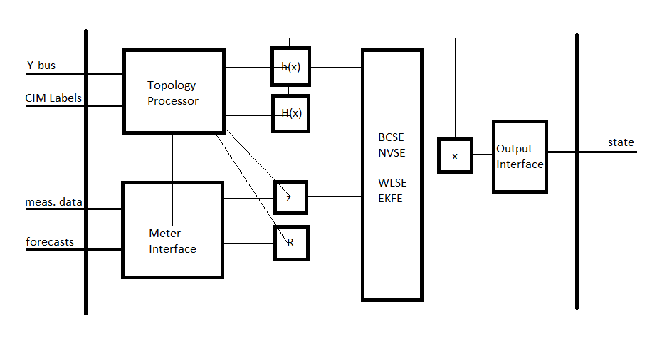

State Estimator
===============

Objectives
----------

State estimation is widely used in transmission system operations but is
less common in distribution system operations due to a relatively
limited value in traditional distribution systems, additional
computational complexity, and a lack of sensors. Advanced distribution
management platforms like GridAPPS-D provide access to model and sensor
data that can be leveraged to overcome barriers to adoption and open the
door to distribution system state estimators that are fast and accurate
enough to be useful in utility operations.

A distribution system state estimator computes the most likely state
given a set of present and/or past measurements. The full state of a
distribution system consists of either the full set of complex bus
voltages or the full set of complex branch currents; given the system
model (admittance matrix), the remaining system parameters can be
computed given the full system state.

Use Cases
~~~~~~~~~

-  Assist power factor optimization: Utility objective is unity
   power-factor at the substation.

-  Assist voltage optimization (planning): Utility objective is 1 p.u.
   voltage at last house primary.

-  Real-time state estimation for advanced applications: applications
   can access the state estimate at a sufficient resolution to capture
   e.g. insolation variation caused by clouds.

Distribution System State Estimation Algorithms
~~~~~~~~~~~~~~~~~~~~~~~~~~~~~~~~~~~~~~~~~~~~~~~

State estimation uses system model information to produce an estimate of
the state vector x given a measurement vector z. The measurement vector
is related to the state vector and an error vector by the measurement
function, which may be non-linear.

.. math:: z = h(x) + e

Multiple formulations of the distribution system state estimation
problem are possible:

1. *Node Voltage State Estimation (NVSE):* The state vector consists of
   node voltage magnitudes and angles for each node in the system (one
   reference angle can be eliminated from the state vector). This
   formulation of the state estimation problem is general to any
   topology and it is the standard for transmission system state
   estimation.

2. *Branch Current State Estimation (BCSE):* Radial topology and
   assumptions about shunt losses create a linear formulation of the
   state estimation problem. The state vector contains branch currents
   and, for a fully-constrained problem, requires one state per load,
   which can be less than the number of branches in the system.

Different algorithms provide different advantages for distribution
system state estimation. A subset of the state estimation algorithms
below will be used to achieve these goals.

1. *Weighted Least Squares Estimation (WLSE)*: a concurrent set of
   measurements are used to find a state vector that minimizes the
   weighted least squares objective function. The algorithm is
   memoryless with respect to previous solutions and measurements should
   be synchronized.

2. *Kalman Filter Estimation (KFE) and Extended Kalman Filter Estimation
   (EKFE)*: The Kalman filter provides a mechanism to consider past
   state estimates alongside present measurements. This provides
   additional noise rejection and allows asynchronous measurements can
   be considered individually. KFE is appropriate for linear BCSE and
   EKFE is compatible with nonlinear NVSE.

3. *Unscented Kalman Filter Estimation (UKFE)*: The unscented transform
   estimates the expected value and variance of the system state by
   observing the system outputs for inputs spanning the full
   dimensionality of the measurement space. Again, the Kalman filter
   provides a mechanism to consider past estimates.

TRL
~~~

The state estimator application will provide the capability to estimate
the full system state using asynchronous measurement data. In addition a
model order reduction technique will be implemented to greatly speed up
the state estimation computation and to reduce the dependence on
forecast-based pseudo-measurements. A paper (*Reduced-Order State
Estimation for Power Distribution Systems with Sparse Sensing*) is
targeted for IEEE Transactions on Power Systems.

Design
------

The state estimation service is being developed in c++. A modern c++
implementation allows the application to adapt to an evolving interface.
The program architecture is shown below.

|image0|

Topology Processor: initializes the measurement function and its
Jacobian and determines the size of the measurement vector, the
measurement covariance matrix, and the state vector.

Meter Interface: updates the measurement vector and the measurement
covariance matrix as new measurement data comes available.

State Estimator: performs the state estimation operation according to
the specified algorithm.

Output Interface: formats the state vector and any implicit states as an
output stream.

Inputs:
~~~~~~~

Upon initialization, the topology processor will receive the Y-bus from
the GridLAB-D service and will query contextual information and sensor
locations from the CIM database.

Periodic measurement data, including any forecasts to be used a
pseudo-measurements will be required as inputs.

A “terminate” command from the platform will end the state estimation
process.

Outputs:
~~~~~~~~

The output will include the full system state (node voltages and/or
branch currents TBD).

Testing and Validation
----------------------

Evaluation metrics
~~~~~~~~~~~~~~~~~~

-  State Error: compare state estimation output to “true” system state.

-  Accuracy over baseline: compare state error of state estimator to
   state error of a QSTS load-flow model.

-  Execution Time

-  Bad Sensor Detection (binary)

Scenarios
~~~~~~~~~

-  Full sensor deployment: verify that the true system state can be
   reproduced.

-  Sparse sensor deployment: verify that the state estimator performs
   better than a QSTS load-flow model.

-  Breaker trip: verify that switch state can be detected even when it
   is reported incorrectly.

-  Bad sensor detection: verify that a sensor that is producing bad data
   can be identified.

-  Dependent application support: verify that the state estimator can
   support e.g. the VVO application.

-  Fault: for a radial system, determine the nearest common bus from
   multiple emulated customer calls.

Operating/Running
-----------------

The state estimator will execute the topology processor at
initialization and will enter a stat estimation loop. The state
estimation loop will exit and the process will end upon receiving a
‘terminate’ command from the platform.

At initialization, a configuration file will be read for:

-  State estimation mode (state vector and algorithm) selection

-  Normalized residual threshold for bad measurement / sensor detection

References
----------

[1] Abur and A. G. Exposito, *Power System State Estimation*, New York,
NY: Marcel Dekker, Inc., 2004.

[2] M. E. Baran and A. W. Kelley, "A branch-current-based state
estimation method for distribution systems," in *IEEE Transactions on
Power Systems*, vol. 10, no. 1, pp. 483-491, Feb 1995.

[3] Z. Jia, J. Chen and Y. Liao, "State estimation in distribution
system considering effects of AMI data," *2013 Proceedings of IEEE
Southeastcon*, Jacksonville, FL, 2013, pp. 1-6.

[4] S. C. Huang, C. N. Lu and Y. L. Lo, "Evaluation of AMI and SCADA
Data Synergy for Distribution Feeder Modeling," in *IEEE Transactions on
Smart Grid*, vol. 6, no. 4, pp. 1639-1647, July 2015.

[5] M. Kettner; M. Paolone, "Sequential Discrete Kalman Filter for
Real-Time State Estimation in Power Distribution Systems: Theory and
Implementation," in *IEEE Transactions on Instrumentation and
Measurement*, vol.PP, no.99, pp. 1-13, Jun. 2017.

[6] G. Valverde and V. Terzija, "Unscented kalman filter for power
system dynamic state estimation," in *IET Generation, Transmission &
Distribution*, vol. 5, no. 1, pp. 29-37, Jan.

