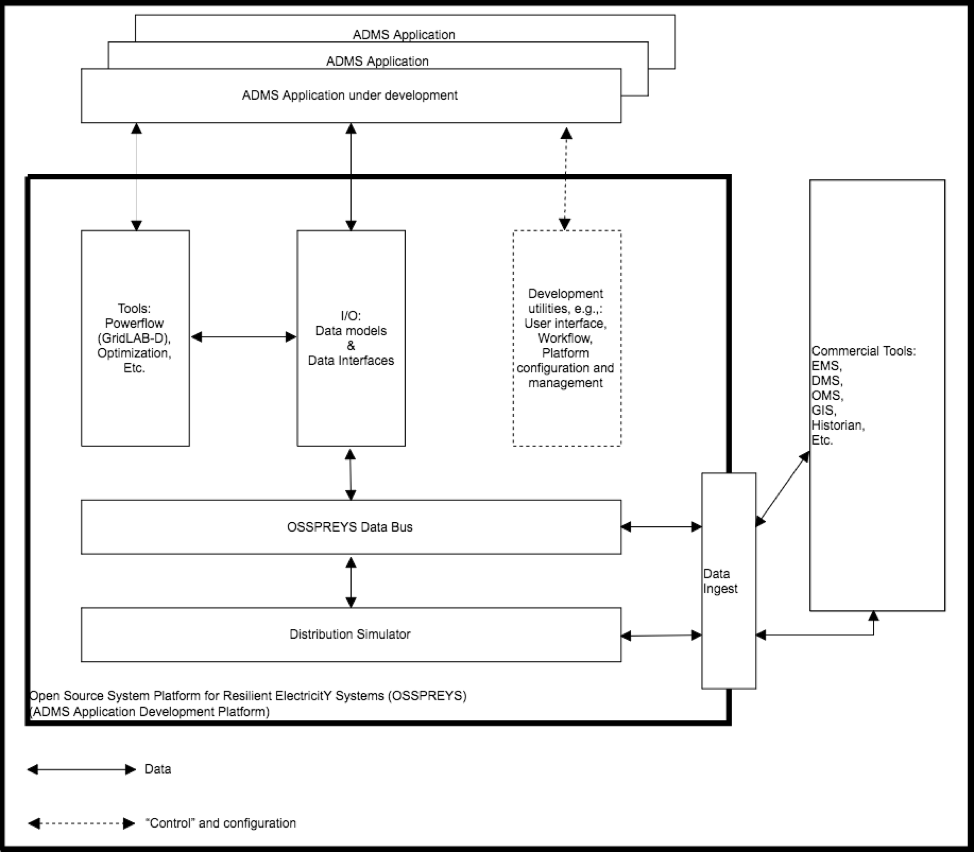

Architecture
------------
 
A conceptual architecture for the system has five key functional elements as shown in 
Figure 1: 

1. **Tools** help developers enhance the functionality of their applications. Examples might include off-line power flow, optimization tool boxes, state estimators, statistical processing, etc.
2. **I/O** allows convenient access to the power system model and data through standards-based queries and messages. Conversely, applications can send control signals to the simulator using standard message schemas.
3. **Development utilities** include loggers, debuggers, access control, test managers, user interface toolkits, and other application support functions.
4. **Data bus** is based on industry standards like IEC 61968 and 61970 (i.e. the Common Information Model), plus more to be identified.
5. **Distribution simulator** represents the power system operating in real time. Initially, this will be GridLAB-D, but future versions may include EPRI's OpenDSS, ns-3 for communications, and other federated co-simulators.

Figure 1 also shows the relationships between GridAPPS-D, the ADMS 
application developer and commercial tools.  Two different classes of data 
flow are shown:

1. Control and configuration data are shown with dashed lines; this allows the application developer to manage the platform.  
2. Data flowing as a part of an application are shown with solid lines.  

For more detailed information about the architecture and design, see :ref:`uml-diagrams-label`

|conceptual_design|

*Figure 1: GridAPPS-D provides a method for developers (top) to run their 
new applications on a real-time simulator with extensive modeling and tool 
support (heavy box).  GridAPPS-D is built around standard data models like 
the CIM (center).  It readily interfaces to existing software products 
(right), which may also 1) use components of GridAPPS-D and 2) supplement or 
replace the built-in distribution simulator (bottom), facilitating the 
deployment of new ADMS applications to existing software products.*

