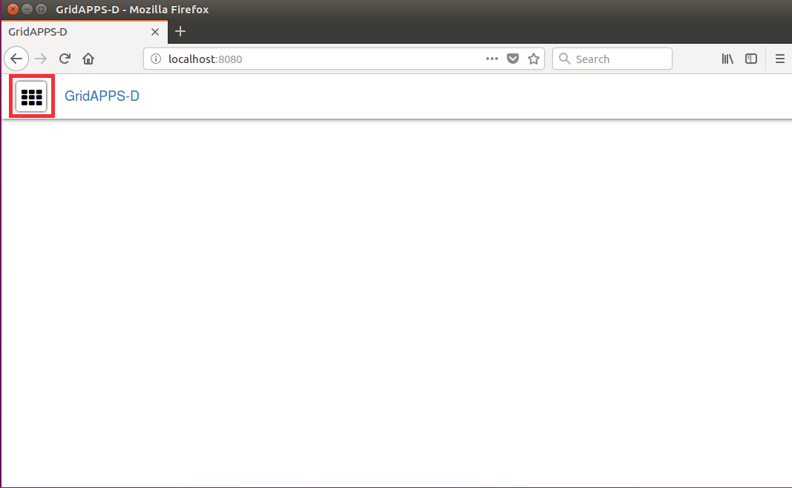
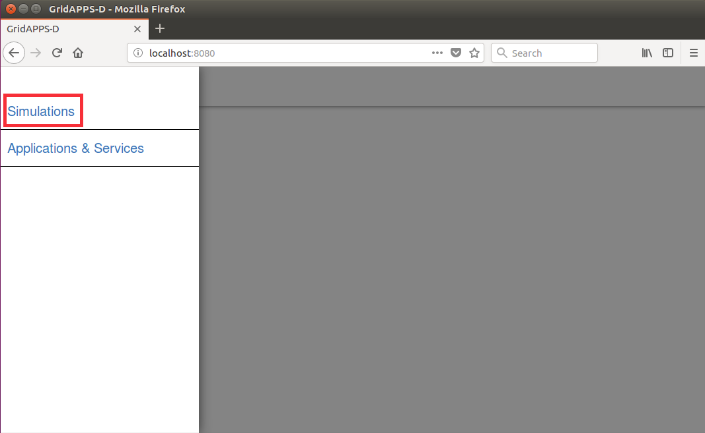
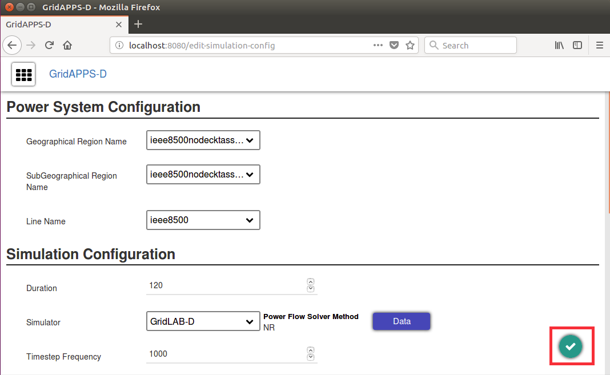
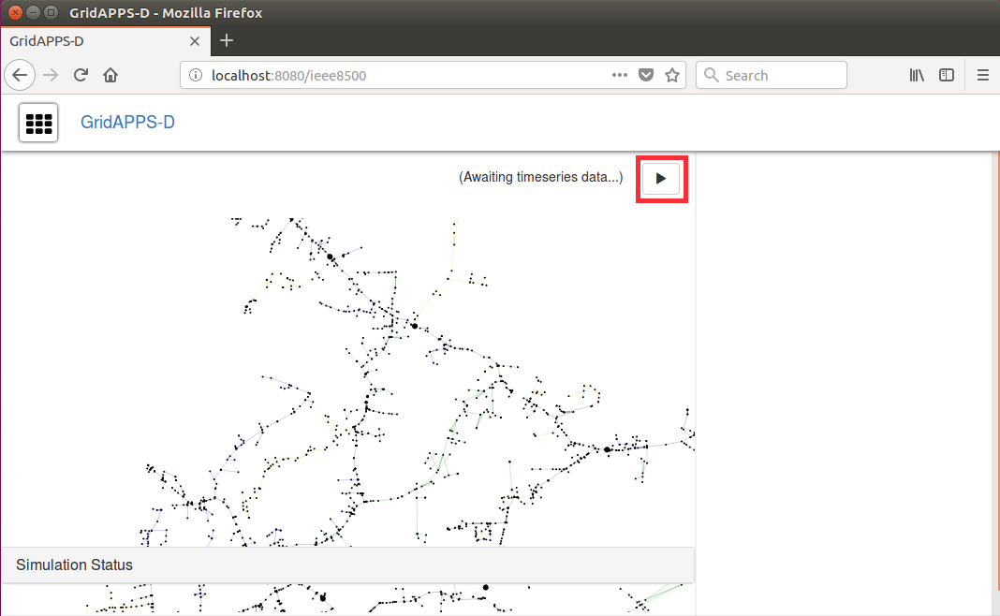

RC3 Demonstration
^^^^^^^^^^^^^^^^^
In order to run the RC3 demonstration you will need to have access to the GridAPPS-D docker containers.

Start gridappsd
---------------

Connect to the running gridappsd container

.. code-block:: bash

  user@foo>docker exec -it gridappsddocker_gridappsd_1 bash

..

Now we are inside the executing container

.. code-block:: bash

  root@737c30c82df7:/gridappsd# ./run-docker.sh

..

Open your browser to http://localhost:8080/ and click the menu button.

    

Choose Simulations from the menu.

Click the check mark to save the configuration.

Click the triangle to start the simulation.

The demonstration runs a continuous loop of load variations with a 
Volt-Var Optimization (VVO) application [CIT5]_ controlling capacitor 
banks on the IEEE 8500-node test system [CIT2]_.  Most of Figure 1 is 
devoted to a map layout view of the test circuit, with updated labels for 
capacitor banks and voltage regulators.  On the right-hand side, strip 
chart plots of the phase ABC voltages at capacitors and regulators, phase 
ABC substation power levels, and phase ABC regulator taps are continually 
updated.  Capacitor bank labels on the circuit map view change between 
OPEN and CLOSED to show the bank status as load varies and the VVO 
application issues control commands.  While GridAPPS-D runs the demo, 
GridLAB-D [CIT8]_ simulates power system operation and exchanges 
information with the VVO application using GOSS [CIT6]_ and FNCS [CIT7]_.
  
For an orderly shutdown of the demonstration:
  
.. code-block:: bash

  Use Ctrl+C to stop gridappsd from running
  exit
  ./stop.sh

..

|rc1_overview_image0|

GridAPPS-D Release Cycle 1 Demo of the Volt-Var Optimization Running on the IEEE 8500-node test system.

.. |rc1_overview_image0| image:: rc1_demo.png

