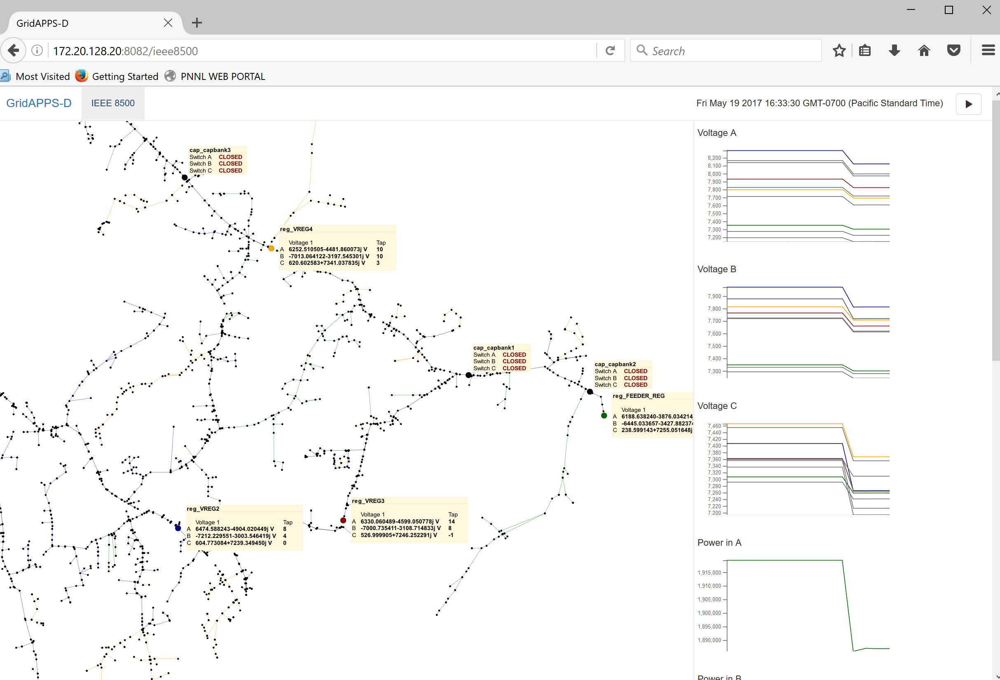

RC1 Demonstration
^^^^^^^^^^^^^^^^^

In this procedure, we log in to a Linux virtual machine (VM) in the PNNL 
Energy Infrastructure Operations Center (EIOC) using a virtual private 
network (VPN) connection and MobaXterm on Windows.  The ssh host for 
GridAPPS-D in the EIOC is at 172.20.128.20, and you would need user 
credentials for both that VM and the VPN connection.  Trusted X11 
forwarding, corresponding to the ssh -X -Y options, should be enabled in 
MobaXterm when logging in.  After logging in, you will have a "terminal 
tab" open to the VM in MobaXterm.  

The procedure will vary if not using MobaXterm or if logging into a local 
build of GridAPPS-D, i.e.  not hosted in PNNL's EIOC.  For example, you 
can use the ssh command from a Terminal such as *ssh -X -Y 
username@your.host.ip.address* and then supply your local password when 
prompted.  You may also need to take extra steps in setting up a secure 
SSH tunnel for your browser to work in step 3 below; please ask your local IT 
administrator for those details.
  
Once connected to the VM hosting GridAPPS-D, there are three basic steps 
involved in starting the RC1 demo: 
 
1. Start GridAPPS-D; this prepares the platform to configure a power system model and generate results.
      a. Open the first terminal to 172.20.128.20.
      b. Switch to the gridappsd user by typing *sudo su - gridappsd*
      c. Type *cd $HOME/gridappds_project/sources/GOSS-GridAPPS-D*
      d. Type *./run-goss-test.sh* You may not see any output and it doesn't exit until you press Ctrl-C.
 
2. Start the node server for the viz application, which allows you to start the simulation and see its results.
      a. Open a second terminal to 172.20.128.20, e.g. right-click on the MobaXterm tab and choose *duplicate*.
      b. Switch to the gridappsd user by typing *sudo su - gridappsd*
      c. Type *cd $HOME/gridappsd_project/sources/viz*
      d. Start the node server by typing *node server.js* You may not see any output and it doesn't exit until you press Ctrl-C.
 
3. Start the viz demo. This requires a browser using an SSH tunnel, which MobaXterm established in the log in process.
      a. In a browser go to http://172.20.128.20:8082/ieee8500
      b. Click on the IEEE 8500 link in the top left of the webpage (see Figure 1).
      c. Click the play button in the top right of the webpage. It will take 5-10 seconds before you see the graphs being generated.
 
The demonstration runs a continuous loop of load variations with a 
Volt-Var Optimization (VVO) application [CIT5]_ controlling capacitor 
banks on the IEEE 8500-node test system [CIT2]_.  Most of Figure 1 is 
devoted to a map layout view of the test circuit, with updated labels for 
capacitor banks and voltage regulators.  On the right-hand side, strip 
chart plots of the phase ABC voltages at capacitors and regulators, phase 
ABC substation power levels, and phase ABC regulator taps are continually 
updated.  Capacitor bank labels on the circuit map view change between 
OPEN and CLOSED to show the bank status as load varies and the VVO 
application issues control commands.  While GridAPPS-D runs the demo, 
GridLAB-D [CIT8]_ simulates power system operation and exchanges 
information with the VVO application using GOSS [CIT6]_ and FNCS [CIT7]_.
  
For an orderly shutdown of the demonstration:
  
1. Close the web browser (i.e. step 3 above).
  
2. Enter Ctrl-C and then *Exit* in the node server's terminal window / tab (i.e. step 2 above).
  
3. Enter Ctrl-C and then *Exit* in the GOSS terminal window (i.e. step 1 above). 
 
4. Log off the VM and the VPN. 

|rc1_overview_image0|

Figure 1: GridAPPS-D Release Cycle 1 Demo of the Volt-Var Optimization Running on the IEEE 8500-node test system.

