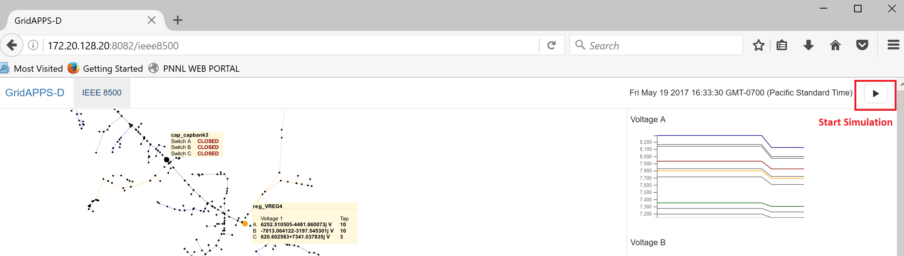

In the web-based visualization, click the Play button at the top right to start the simulation using the default run configuration.  Behind the scenes this uses the websockets/javascript API described in a previous section.

|rc1_starting_in_viz_image0|

